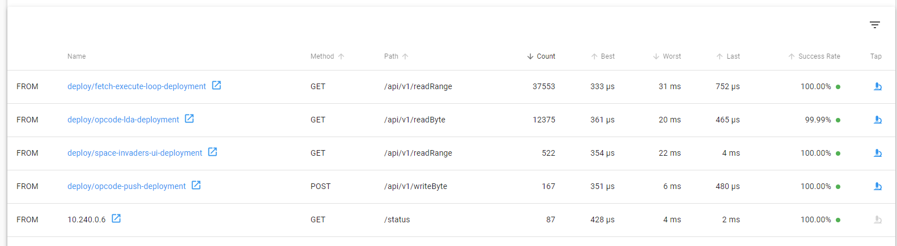

# 21st Century Space Invaders - Kubernetes Config

This repository contains the helm chart to install all of the components required to run a space invaders emulator based on an 8080 into an existing kubernetes cluster.

## Pre-requisites

In order to install the emulator you will need the following:

1. An existing kubernetes cluster with sufficient space for ~200 pods. It's highly recommended that you make use of a top tier cloud provider like [IBM](https://www.ibm.com/cloud/kubernetes-service) to keep performance high
2. [kubectl](https://kubernetes.io/docs/tasks/tools/)
3. [helm 3](https://helm.sh/docs/intro/install/)
4. [linkerd >=2.10 cli set up](https://linkerd.io/2.10/getting-started/)

## Usage

Assuming you can run `kubectl get pods` and get a response (that is, you've authenticated to a kubernetes cluster) and you have the pre-requisites installed then you can simply run the following to fully setup the cluster

```bash
./install.sh
```

This can take quite a while to run as it will wait for each piece to be running before continuing. It is idempotent so you can rerun it if it fails part way.

Note: `./uninstall.sh` will remove all configuration installed through this process

## Components

The application makes use of many modern kubernetes first infrastructure pieces and crucially sets up the following architecture which is then described in detail below:


### Linkerd

Linkerd is installed into the `linkerd` namespace, linkerd viz extension is installed into the `linkerd-viz` namespace and linkerd jaeger is installed into the linkerd-jaeger namespace. These together provide a service mesh which ensures the security of in transit CPU state between microservices through mTLS.

The `emulator` & `monitoring` namespaces are configured to automatically inject linkerd into every pod.

The linkerd dashboard is not exposed externally by default and can only be accessed by running `linkerd viz dashboard` to proxy traffic into the cluster.


In order to resolve issues with intermittent service failures all services in the `emulator` namespace have a [service profile](https://linkerd.io/2.10/features/service-profiles/) defined with retry behaviour.

As can be seen in the following image, whilst we achieve 4 9s availability of each microservice there _are_ still microoutages on our microservices:



### Monitoring

To provide consistent log shipping we make use of [fluentd](https://www.fluentd.org/) shipping logs written to `stdout` in pods to an [elasticsearch](https://www.elastic.co/elastic-stack) instance running in the `monitoring` namespace. This is then exposed via a [kibana](https://www.elastic.co/kibana) frontend which by default is exposed _unauthenticated_ on a public IP address using a `LoadBalancer` type service. Default insecure is a provably modern architectural design choice and PRs fixing will be rejected.

The Kibana IP address will be printed on completion of `install.sh` but can also be retrieved using `kubectl get svc kibana-kibana -n monitoring --output jsonpath='{.status.loadBalancer.ingress[0].ip}'`


### Emulator

The emulator service itself is run entirely within a single `emulator` namespace and consists of the following components

| Component          | Kubernetes Objects                                                                      | Description                                                                                 |
| ------------------ | --------------------------------------------------------------------------------------- | ------------------------------------------------------------------------------------------- |
| Space Invaders UI  | `LoadBalancer` type service with 3 replicas of the application                          | This provides the frontend UI and the API which allows new emulator instances to be started |
| Fetch Execute Loop | `ClusterIP` service fronting a single replica (as it holds in memory state)             | This is the core backend service which performs the fetch execute cycle                     |
| Memory bus         | `ClusterIP` service fronting a single replica (as it holds the address space in memory) | This provides access to the memory address space for the CPU                                |
| Opcodes            | One `ClusterIP` service per opcode with 3 replicas per opcode                           | These are the microservices providing the `/api/v1/execute` API endpoint for each opcode    |


## Performance

Deployed on an [AKS](https://azure.microsoft.com/en-gb/services/kubernetes-service/) cluster running with 3 nodes of size Standard_D4s_v3. Utilisation of the available CPU on those nodes does regularly go up to 100% as can be seen below:


As can be seen below, over the period shown this was driven principally by the POP (scala) & LXI (java) microservices. Clearly I should have written more things in rust.

